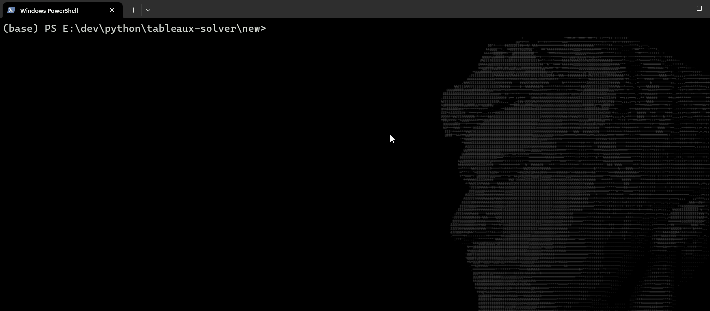

# Tableau Solver

A solver for analytical tableau given in a specific syntax

## Syntax

### Symbols

The syntax for the tableau solver is organized into different types of logical symbols and constructs, categorized as follows:

#### Propositional Symbols

- **Propositional Variables**: `p`, `q`, `r`, `s`
  These are the basic variables used in propositional logic expressions.

#### Binary Operators

- **Conjunction**: `/\`
- **Disjunction**: `\/`
- **Implication**: `=>`
  These operators are used to build complex expressions from simpler propositional variables.

**IMPORTANT** All binary operators must be encased in brackets; so

- `(p/\q)` can be parsed
- `p/\q` cannot be parsed

#### Unary Operator

- **Negation**: `~`
  Used to negate a formula.

### First Order Logic (FOL) Symbols

#### Variables

- **Variables**: `x`, `y`, `z`, `w`
  Used as placeholders in predicates and quantified formulas.

#### Predicate Symbols

- **Binary Predicates**: `P`, `Q`, `R`, `S`
  These are used to express relations between two variables.

#### Quantifiers

- **Existential Quantifier**: `E`
  Indicates the existence of at least one element satisfying the formula.
- **Universal Quantifier**: `A`
  Indicates that all elements satisfy the formula.

### Formulas

Formulas in this syntax can be constructed using the above symbols based on the rules of propositional and first-order logic (FOL). Formulas are expressed in a precise and compact manner without white spaces or extra brackets.

#### Example Formulas

- **Propositional**: `((p/\q)=>r)`
- **First Order Logic**: `ExEzEy(P(x,y)\/~Q(x,z))`

This structure ensures clear and concise representation of logical expressions in both propositional and first-order logic contexts.
